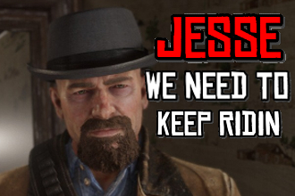

# GAME_REM
C / LUA small factor game engine

(goal is to add support to all of these things below and keep the engine under 1k lines excluding external packages)

Sound Support - Yes (.mp3)<br>
Input Support - Yes<br>
DrawPixel Support - Yes<br>
DrawSquare Support - Yes<br>


Text Support - No<br>
Texture Support - Yes


Example Script<br>
```lua
GAME_TICKRATE = 80

WINDOWDATA_Title = "hello world"

if WINDOWDATA_Title == "hello world" then
  print("hi")
end

if C_Tick % 10 then
  PlaySound("sound.mp3")
end

if IsKeyDown(13) then
  print("enter is down")
end

DrawBackground(255,255,0)

UpdateWindow()
```

</img>

Developed and mantained by shadowdev / shadowstudios 2025
